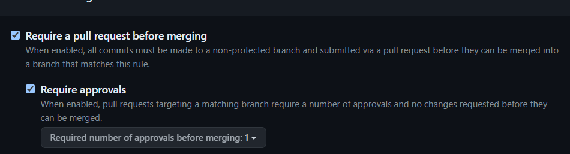

# Exercice 2
### Fait par Yann Sady

## Bonne pratiques git
Les bonnes pratiques sont :
- d'avoir une branche master/main protégé (autorisé que les pull request mais pas le merge direct ou encore de push dedans)
- travailler sur des branches différentes en fonction des dev/features
- protéger les branches différentes (dev/features) pour n'autorisé que les commits et push des personnes travaillant dessus
- commit et push au fur et à mesure que les tâches sont finies
- mettre des commits descriptif et pas général/flou
- ne pas permettre d'outrepassé les protections mêmes pour l'admin

## Application des bonnes pratiques
J'ai commencé par protégé ma branche main :  
  
  
  
  
Et j'ai également protégé ma branche de travail (ici tp1) :  
