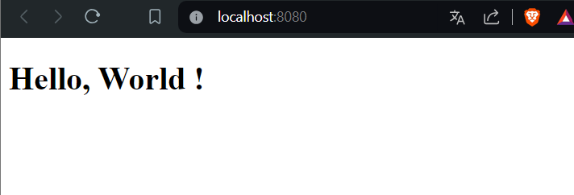
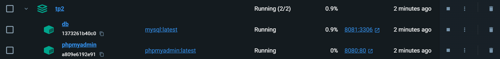

# TP2
### Fait par Yann Sady

## 3. Exécuter un serveur web (apache, nginx) dans un container docker

a. ```docker pull nginx```

b. 

c. Fichier crée dans le dossier html

d. ```docker run -d -p 8080:80 --name container_hello_world -v "$(pwd)/html/index.html:/usr/share/nginx/html/index.html" nginx```

On peut voir index.html :  


e. ```docker rm container_hello_world```

f. Je relance le container sans -v : ```docker run -d -p 8080:80 --name container_hello_world nginx```

Puis je copie le chemin de mon dossier en local dans mon container : ```docker cp "$(pwd)/html/index.html" container_hello_world:/usr/share/nginx/html/index.html```

Et on peut voir que cela fonctionne :  


## 4. Builder une image

a. J'ai crée le dossier Dockerfile :  
```
FROM nginx

WORKDIR /usr/share/nginx/html

COPY ./html/index.html ./usr/share/nginx/html/index.html

EXPOSE 8080

CMD ["nginx", "-g", "daemon off;"]
```  
Puis j'ai fait la commande : ```docker build -t mon-serveur-nginx .``` pour build mon image.

b. J'exécute ma nouvelle image via la commande ```docker run -d -p 8080:80 mon-serveur-nginx```  
Voici mon index.html :


c. Dans la question 3, on a utilisé le montage de volume avec -v alors que dans la question 4, on a directement copié le fichier index.html dans l'image que l'on a crée avec le Dockerfile.

Pour le mount volume :
- Avantages : Plus simple à mettre en place car il n'y a pas besoin de créer de Dockerfile
- Inconvénients : Commandes longues à taper

Pour la copy :
- Avantages : Moins de commande à taper et donc plus rapide à exécuter
- Inconvénients : Plus complexe à mettre en place car il faut créer un Dockerfile et connaitre la syntaxe pour le faire

## 5. Utiliser une base de données dans un container docker

a. Mysql : ```docker pull mysql``` et phpmyadmin : ```docker pull phpmyadmin```

b. J'ai exécuté :
- ```docker run -d -p 8081:80 --name mon_container_mysql -e MYSQL_ALLOW_EMPTY_PASSWORD=yes mysql``` 
- ```docker run -d -p 8080:80 --name mon_container_phpmyadmin phpmyadmin```

Ensuite il faut que l'on connecte les 2 containers via un network, pour commencer j'ai crée un network ```docker network create reseau_bdd```

Puis j'ai ajouté mes 2 containers dans ce network :
- ```docker network connect reseau_bdd mon_container_mysql```
- ```docker network connect reseau_bdd mon_container_phpmyadmin```

Ensuite pour que mon container phpmyadmin utilise le nom d'hôte pour mettre mon container mysql


J'ai crée une bdd nommé test_bdd puis une table via l'interface :


Et on peut voir qu'elle a bien été crée :


## 6. Utilisation de docker-compose.yml

a. La commande docker run sert à lancer et crée un container individuel à partir d'une image tandis que docker-compose sert à lancer plusieurs containers en même temps grâce à un fichier yaml qui spécifie les images à utiliser, les containers à lancer/crée ou les ports à exposer et tous ça en une seule commande.

b. Les commandes :
- pour lancer et créer : ```docker-compose up``` 
- pour lancer: ```docker-compose start``` 
- pour stopper: ```docker-compose stop``` 
- pour stopper et supprimer: ```docker-compose down``` 

c. J'ai crée mon fichier docker-compose.yml (à la racine du projet) :
```
version: '3'
 
services:
  db:
    image: mysql:latest
    container_name: db
    environment:
      MYSQL_ROOT_PASSWORD: mdp
    ports:
      - "8081:3306"
    volumes:
      - tp2_data:/var/lib/mysql
  phpmyadmin:
    image: phpmyadmin/phpmyadmin
    container_name: phpmyadmin
    links:
      - db
    environment:
      PMA_HOST: db
      PMA_PORT: 3306
    restart: always
    ports:
      - 8080:80
volumes:
  tp2_data:
```  
Puis j'ai crée et démarrer les containers grâce à la commande ```docker-compose up```.

On peut voir que les containers se sont bien crée :


Puis on peut accéder à phpmyadmin :
