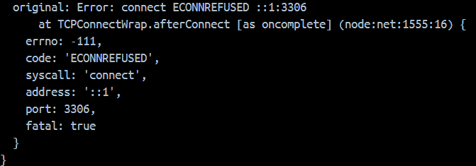

# TP3
### Fait par Yann Sady

## 2. Créer un Dockerfile qui permet de lancer une application NodeJS (v18-alpine ou v20)

J'ai crée le Dockerfile :
```
FROM node:18-alpine

WORKDIR /home/node/app

COPY ./e-bakery/ ./

RUN npm install

EXPOSE 80

CMD ["node", "server.js"]
``` 

## 3. Utilisez docker pour lancer une image de base de données (mysql ou mariadb)

J'ai fait la commande : ```docker run -d -p 3000:80 --name mon_container_mysql -e MYSQL_ALLOW_EMPTY_PASSWORD=yes mysql```

## 4. Rebuildez votre image docker et relancez un container, vérifiez que vous arrivez à utiliser l'app
D'abord j'ai commencé par build mon image : ```docker build -t api-e-bakery .```

Ensuite que l'api puisse avoir accès à la bdd, j'ai crée un network ```docker network create reseau_api```

Puis j'ai ajouté mes 2 containers dans ce network :
- ```docker network connect reseau_api mon_container_mysql```
- ```docker network connect reseau_api container_api```

Ensuite dans mon container mysql je me suis connecté puis j'ai crée la table e-bakery, voici les 2 commandes :
- ```docker exec -it mon_container_mysql mysql -uroot -p```
- ```CREATE DATABASE 'e-bakery';```

Et enfin, j'ai démarré mon container : ```docker run -d -p 8080:80 --name container_api api-e-bakery```

Et on peut voir que cela fonctionne :


## 5. Créer un docker-compose.yml pour avoir 2 services (node et db)
J'ai crée le docker-compose :
```
version: '3'
 
services:
  db:
    image: mysql:latest
    container_name: db
    environment:
      MYSQL_ROOT_PASSWORD: mdp
    ports:
      - "3000:3306"
    volumes:
      - tp3_data:/var/lib/mysql
      - ./init.sql:/docker-entrypoint-initdb.d/init.sql
  node:
    build: .
    container_name: node
    links:
      - db
    restart: always
    ports:
      - 8080:80
      
volumes:
  tp3_data:
```

## 6. Faire les adaptations nécessaires au docker-compose pour que votre app puisse utiliser votre base de données conteneurisée

Malgré le fait que j'ai mis un lien à db dans le docker-compose, le container node redémarre en boucle :


Et c'est du à une erreur de connection avec la base de données :


Mais nous rétablirons le lien dans l'étape 8

## 7. Utilisez des variables d'environnement dans votre docker-compose ET adaptez l'application (db.config.js) pour utiliser ces variables

D'abord j'ai crée les variables dans .env :  


Ensuite je les ai mise dans config.js :  


Puis dans mon docker-compose :  
  
(ici j'ai ajouté à node environment pour ajouter les variables d'environnement)

## 8. Faites en sorte d'isoler vos 2 services docker-compose sur le même network.

Après avoir modifier mon docker-compose :  
```
version: '3'
 
services:
  node:
    build: .
    container_name: node
    networks:
      - tp3-network
    depends_on:
      - db
    environment:
      DB_USERNAME: ${DB_USERNAME}
      DB_PASSWORD: ${DB_PASSWORD}
      DB_NAME: ${DB_NAME}
      DB_HOST: ${DB_HOST}
      DB_DIALECT: ${DB_DIALECT}
      PORT: ${PORT}
    restart: always
    ports:
      - 8080:80
  db:
    image: mysql:latest
    container_name: db
    networks:
      - tp3-network
    environment:
      MYSQL_ROOT_PASSWORD: ${DB_PASSWORD}
    ports:
      - "3306"
    volumes:
      - tp3_data:/var/lib/mysql
      - ./init.sql:/docker-entrypoint-initdb.d/init.sql

networks:
  tp3-network:
    driver: bridge
    name: tp3-network

volumes:
  tp3_data:
```

On peut voir que cela fonctionne bien :  
  
  

## Questions
**- Q1: Que ce passe t-il si l'un des ports publiés est déjà utilisé ?**  
  Cela indique une erreur expliquant que le port est déjà utilisé.  
  
**- Q2: Quelle option de la commande npm install permet de n'installer que les dépendances de production ?**  
  L'option pour installer que les dépendances de production est ```--production```.  
  
**- Q2 bis: Pourquoi faire cela ?**  
  Cela permet de réduire la taille de l'application en enlevant toutes les dépendances de dev etc... pas utile à la production.  
  
  Cela améliore également la sécurité car il y a une moins grande fenêtre d'attaque du au fait que moins de dépendances et leur potetiels vulnérabilités sont présentes.  
  
  Et cela permet d'éviter les conflits qu'il pourrait y avoir entre les dépendances de production et de developpement à cause de leur versions ou autres.  
  
**- Q3: Comment peut-on analyser la sécurité d'une application comme celle-ci (dépendances & image docker) ?**  
  Pour analyser la sécurité les dépendances d'une app node js on peut utiliser la commande ```npm audit``` pour vérifier les vulnérabilités des dépendances.  
  
  Pour une image docker, on peut utiliser la commande ```docker scan nom_image```, cependant on peut scanner que 10 images par mois gratuitement.  
  
  Mais il existe des solutions open-source tels que clair, trivy, snyk etc... après installation, on peut utiliser les commandes relatives aux solutions.  
  Cela peut être utile si on a besoin de faire plus de 10 analyses de sécurité par mois d'images docker, sinon on peut se contenter de docker scan.  
  
**- Q4: Pourquoi à l'étape 6 mon container node n'arrive pas à communiquer avec ma base de données si je laisse localhost en hostname ?**  
  Cela est du au fait que mon container va utiliser son localhost mais pas la base de données se trouve dans un autre container, il ne peut donc pas communiquer.  
  Pour résoudre le problème, il a fallu mettre le nom du service de la base de données et comme les 2 containers étaient sur le même réseau, ils ont pu communiquer car le container de l'app se connectait bien au container de base de données et plus à son localhost. 